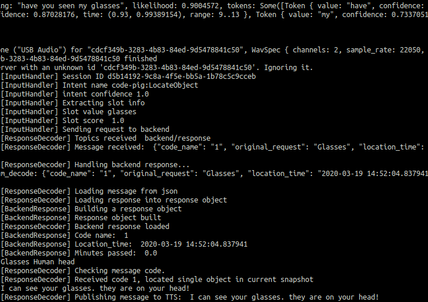

# Wheres My Glasses (Frontend)
Action code for a voice assistant that handles requests relating to locating objects around the smart home.
Originally designed to run on raspberry pi and work with
the [associated backend system](https://github.com/d3-worgan/WheresMyGlassesBackend) to form a smart home object location assistant.

  

Unfortunately the voice platform Snips is no longer supported and so adjustment is needed for the project
to work with something like Rhasspy (open source) or some other assistant like google or alexa.